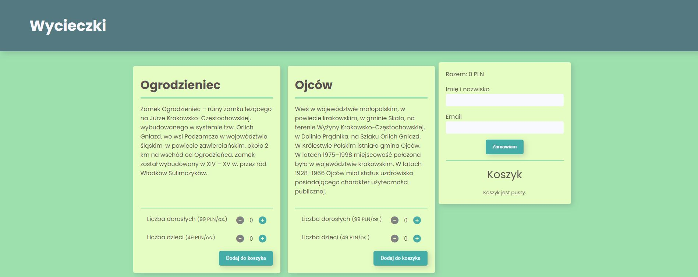
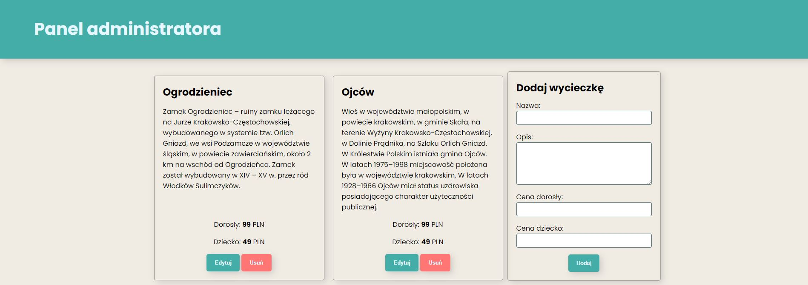

# Excursions app – API practice

The main goal of the project was to practice an API management (GET, POST, PUT, DELETE)

**Main features**:

Global
- **OOP** (object-oriented programming)
- Loading and inserting data from **API** to DOM (GET)
- Form handling
- Form validation (using JavaScript)

User panel
- Basket management (adding, removing items)
- Showing modal with order summary
- Sending order to local database (POST)

Admin panel
- Adding new excursions (POST)
- Updating excursions (PUT)
- Removing excursions (DELETE)

&nbsp;
 
## 💡 Technologies

&nbsp;
 
## 🔗 See also

Are you interested in **BEM** and **RWD**? See my other project [AppLab RWD template project](https://github.com/mikepatch/AppLab-RWD-template-project).

&nbsp;
 
## 💿 Installation

The project uses [node](https://nodejs.org/en/) and [npm](https://www.npmjs.com/). Having them installed, type into the terminal: `npm i`.

Run webpack

`npm start`

To run user view type in your browser: `http:/localhost:8080/index.html`, for admin view: `http://localhost:8080/admin.html`.

JSON Server

If you don't have installed JSON server on your computer, type in terminal:

`npm install -g json-server`

Then, you can run API using following command (from main folder):

`npm run api`

&nbsp;

## 👏 Thanks / Special thanks / Credits
Thanks to my [Mentor - devmentor.pl](https://devmentor.pl/) – for providing me with this task and for code review.